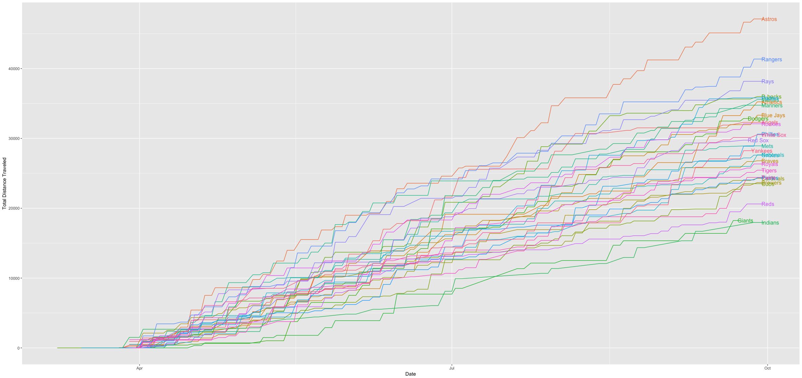

# Travel time in Major League Baseball

What can we learn if we look at the time MLB teams will travel over the course of the 2018 season? I'm not trying to predict anything with this data, just trying to play around with visualizing the data in interesting ways. Right now I have the following files under `data.csv`:

- `{TEAM}.csv` - a list of games that will be played by a team. The relevant pieces of data are as follows:
  - `START DATE`
  - `SUBJECT` - a game description (eg. "Pirates at Mariners")
  - `LOCATION` - where the game is being played (eg. "Safeco Field")
  - all other data is remnants of `mlb.com` poorly converting from iCal invites to CSV
- `distance matrix.csv`
  - a distance matrix in miles to/from every ballpark in the MLB

So far I have generated a these graphs:

-  Ranking all of the stadiums on their mean distance to all of the other parks. This however is a very naïve way to look at the data, as no team plays the other 29 in an equal proportion.

-  Cumulative distance traveled by each team over the course of the season

## Sources of Data

- Schedules of games - downloaded directly from `http://www.ticketing-client.com/ticketing-client/csv/EventTicketPromotionPrice.tiksrv\?team_id\={TEAM ID}`
- Distance matrix of parks - from `https://bitbucket.org/trhdata/mlb-stadiums/src`
